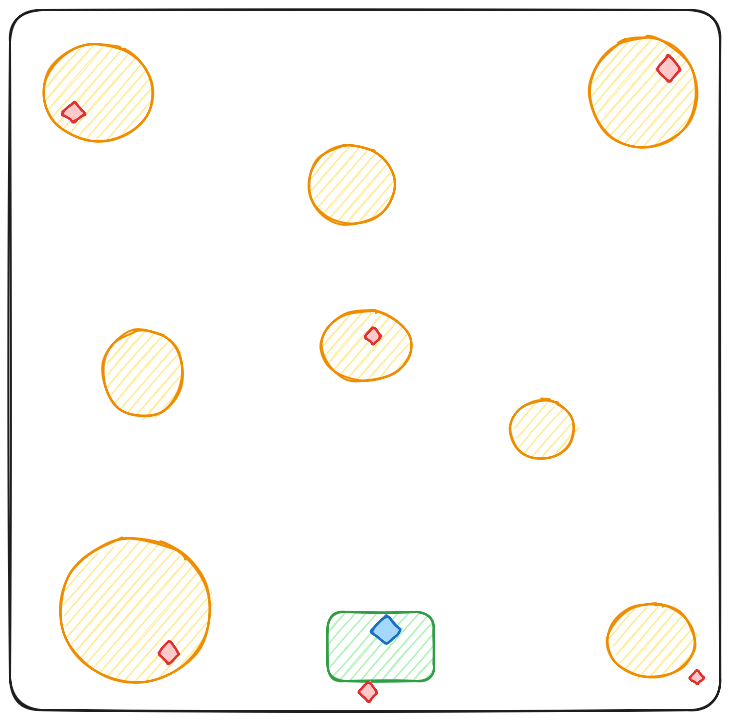

<h1 align="center">
   
  
   
  FOLIO
   
</h1>

<h4 align="center">FOLIO is a first-person psychological horror game, combining retro PS1 visuals with modern mechanics. Players assume the role of a lone protagonist exploring an open environment, where each collected document gradually reveals clues about a potential escape route... while simultaneously drawing unwanted attention.</h4>

  <!-- Version -->
  
  
  <!-- License -->
  
  
  <!-- Godot Engine -->
  
  
  <!-- Platform -->
  

  <a href="#download">Download</a> •
  <a href="#game-mechanics">Game Mechanics</a> •
  <a href="#entity-system">Entity System</a> •
  <a href="#key-technical-systems">Key Technical Systems</a> •
  <a href="#artistic-direction">Artistic Direction</a> •
  <a href="#technologies">Technologies</a> •
  <a href="#known-issues">Known Issues</a> •
  <a href="#perspectives">Perspectives</a> •
  <a href="#credits">Credits</a> •
  <a href="#license">License</a>

  

  <strong>Note</strong>: Complete technical demo (Godot 4.3) for academic evaluation purposes.

## Installation (Windows)

### Stable Release
 (~1,6 Go)

### Download  
**Standalone Game - No Installation Required :**
1. Download the `.exe` file  
2. Run it directly to launch the game  

> **Note**: If Windows blocks execution, click **"More info"**, then **"Run anyway"**  

## Game Mechanics  
**Playtime:** Approximate playtime: 1-2 hours (first run)
**No Save System:** The game must be completed in a single session to maintain tension.  

### Movement System  
- **Sprinting & Stamina Management:**  
  - Stamina bar depletes gradually and regenerates slowly.  
  - **Breathing mechanic** notifies when stamina is restored.  
  - Louder footsteps while running.  

### Environment Interaction  
- **Flashlight:** Always on to enhance the dark atmosphere and limit visibility.  

### Page Collection  
- **Scattered Pages:**  
  - 6 hidden pages with no hints, encouraging exploration.  
- **Collection Mechanic:**  
  - Displays the number of collected pages.  
  - Each page collected **briefly alerts enemies**.  

### Victory Condition  
1️⃣ **Collect all pages**.  
2️⃣ **Return to the car to escape**.  

## Entity System  

### **Common Traits**  
✔️ Constant communication between entities.  
✔️ Share player position when detected.  
✔️ Synchronized behavior for increased pressure.  

### **Threat Hierarchy**  
**Killer Entities (x2)**  
- Varying speeds and detection zones.  
- Close-contact attack mechanics.  
- React to sound and visual stimuli.  

**Observer Entity (x1)**  
- Cannot attack but has a **wide detection range**.  
- Enhances the effectiveness of other entities.  

## Key Technical Systems  

**Monster AI**  
- Random movement with recalibration upon detection.  
- Reacts dynamically to page collection.  

**Spatialized Audio**  
- 3D sound for better threat localization.  

**Chunk System (Performance Optimization)**  
- Dynamic loading/unloading of game world chunks.  
- Reduces CPU & GPU load for smoother performance.  

## Artistic Direction  

**Sound Design**  
- Dynamic playlist: whispers, ambient sounds, randomized music.  
- **All assets from a single creator** for consistency.  

**Visual Effects**  
- **Dynamic weather** (lightning, rain) & particle effects (fireflies).  
- **Unified shaders** for vegetation.  
- **Retro PSX-style graphics** with enhanced shaders for nostalgia.  

## Technologies  
- **Engine** : Godot 4.3  
- **Languages** : Gdscript  
- **Graphics** : Blender  
- **Audio** : Audacity  
- **Management** : Notion/Github

## Known Issues  
| Category        | Issue                                            | Potential Cause                                      | Solution                                                |
|-----------------|--------------------------------------------------|-----------------------------------------------------|---------------------------------------------------------|  
| **Gameplay**    | Some obstacles interact poorly with the player, leading to blocking or, in rare cases, falling under the map | High player speed and collision detection not optimized for fast movements | Avoid running directly into obstacles                    |  
| **AI**          | Monsters can get stuck on obstacles              | Raycast system only works on certain elements        | Improve raycast system                                   |  
| **Monster**     | Some monsters appear to "float" due to a misalignment between their position and the ground | 3D navigation architecture requiring recalibration   | Full correction would require a complete map overhaul   |  
| **Rendering**   | Poor performance when looking at the center of the map | Rendering a large number of objects simultaneously caused slowdowns | "Chunk" system to limit loading to visible elements (Currently implemented but not tested on mid-range machines) |

## Perspectives

Creating this **Slender-like** was my first real project in Godot, and it provided me with invaluable learning experiences, allowing me to:

- Master the basics: GDScript, scene management, collisions, and simple AI.
- Understand the importance of atmosphere: Spatialized sound, dynamic lighting, and post-processing effects to heighten the horror.
- Tackle technical constraints: Optimizing performance to prevent lag, even within the limits of a 2D/3D engine.
- Iterate on design: Testing and adjusting difficulty to balance fear with playability.

While this game was primarily a technical exercise, it solidified my passion for game design and gave me the confidence to take on more ambitious projects.

### My Next Project
I'm planning to create a challenging and precise platformer (like *Celeste*), with a modular level creation system inspired by *Super Mario Maker*.

#### Objectives:

- **Advanced Movement Mechanics:**
  - Wall-running, air dashing, and tight physics for ultra-precise control.

- **Intuitive Creation Mode:**
  - Simple tools for placing blocks, traps, and enemies, with online sharing capabilities.

#### Why this project?

- **Personal Passion:** I love challenging platformers and want to create an experience that combines deep gameplay with community-driven creativity.
- **Technical Challenge:**
  - Implementing a robust level editor + online save system.
  - Optimizing physics for millimeter-perfect movement.

### Long-Term Vision

In the future, I aim to:

- Release the platformer on **Steam/itch.io**, with updates based on player feedback.
- Explore other genres, particularly **roguelikes**.

## Credits
The visual and audio assets are primarily sourced from platforms like itch.io, under Creative Commons or royalty-free licenses. The base animations were obtained via Mixamo. All of these elements have been modified and optimized in Blender to fit the specific needs of the project and ensure artistic consistency.

## License
Free to use under the [MIT License](./LICENSE.md), with the condition that you **credit me** (Sanko) and **retain this notice**.

## Map of Notes (Spoilers)

CLICK TO REVEAL THE MAP OF NOTES (SPOILERS)

- **Green**: Spawn point
- **Orange**: Areas
- **Red**: Pages
- **Blue**: Player's location

> Note: This map provides spoilers, showing the locations of key elements in the game. Use it only if you want to know where everything is!

